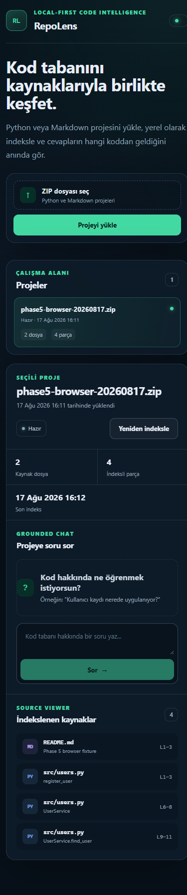
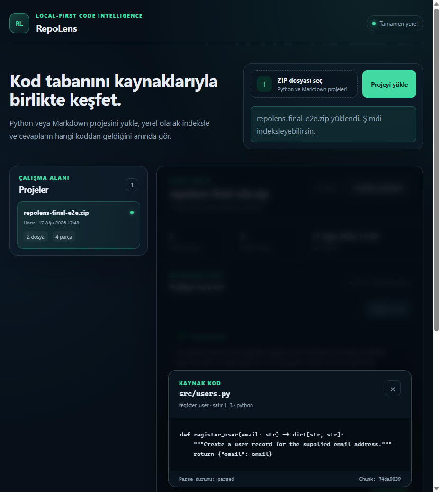
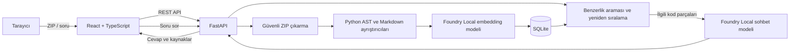

# RepoLens


**Yerel çalışan, cevaplarını gerçek kaynak kodla destekleyen yapay zekâ tabanlı kod deposu asistanı.**

RepoLens, yabancı bir Python projesini daha hızlı anlamak için geliştirilmiş yerel öncelikli bir RAG uygulamasıdır. Kullanıcı bir ZIP dosyası yükler; RepoLens desteklenen kaynakları güvenli biçimde ayrıştırır, yerel olarak indeksler ve proje hakkındaki soruları dosya ve satır aralığı göstererek yanıtlar.

Proje, **Microsoft AI Innovators Programı** kapsamında RAG mimarisi, yerel yapay zekâ modelleri ve kaynaklara dayalı cevap üretme yaklaşımını uçtan uca uygulamak amacıyla geliştirilmiştir.

> **Durum:** Çalışan MVP tamamlandı. RepoLens küçük ve orta ölçekli Python/Markdown projelerinde yerel kullanım için tasarlanmıştır.

<p align="center">
  
  &nbsp;&nbsp;
  
</p>

## İçindekiler

- [Neden RepoLens?](#neden-repolens)
- [Öne çıkan özellikler](#öne-çıkan-özellikler)
- [Nasıl çalışır?](#nasıl-çalışır)
- [Mimari](#mimari)
- [Teknoloji yığını](#teknoloji-yığını)
- [Proje yapısı](#proje-yapısı)
- [Hızlı başlangıç](#hızlı-başlangıç)
- [Kullanım](#kullanım)
- [Yapılandırma](#yapılandırma)
- [API özeti](#api-özeti)
- [Test ve değerlendirme](#test-ve-değerlendirme)
- [Gizlilik ve güvenlik](#gizlilik-ve-güvenlik)
- [Bilinen sınırlamalar](#bilinen-sınırlamalar)
- [Yol haritası](#yol-haritası)

## Neden RepoLens?

Yeni bir kod deposuna başlarken doğru dosyayı, fonksiyonu veya sınıfı bulmak zaman alabilir. Bulut tabanlı yapay zekâ araçlarına özel kaynak kod göndermek de her proje için uygun olmayabilir.

RepoLens bu probleme üç temel yaklaşımla çözüm üretir:

1. **Yerel çalışma:** Kaynak kod ve model çıkarımı kullanıcının cihazında kalır.
2. **İlgili bağlamı bulma:** Projenin tamamını modele vermek yerine soruyla ilişkili kod parçaları seçilir.
3. **Doğrulanabilir cevap:** Her cevap gerçek dosya, sembol ve satır aralığıyla birlikte gösterilir.

## Öne çıkan özellikler

- Güvenli ZIP doğrulama ve çıkarma
- Python AST tabanlı modül, fonksiyon, sınıf ve metot parçalama
- Markdown ve MDX başlıklarına göre doküman parçalama
- Yerel embedding üretimi ve SQLite üzerinde vektör saklama
- Kosinüs benzerliği ve kod odaklı yeniden sıralama
- Yerel Foundry modeliyle kaynaklara dayalı sohbet
- Bağlamı koruyan takip soruları
- Dosya, sembol, satır aralığı ve kod parçası içeren kaynak kartları
- Yeterli kaynak bulunamadığında kontrollü `insufficient_context` cevabı
- React tabanlı yükleme, indeksleme, sohbet ve kaynak görüntüleme arayüzü
- Deterministik backend testleri ve tekrarlanabilir değerlendirme seti

## Nasıl çalışır?

```text
ZIP yükleme
    ↓
Güvenli çıkarma ve dosya filtreleme
    ↓
Python AST / Markdown parçalama
    ↓
Yerel embedding üretimi ve SQLite'a kaydetme
    ↓
Soruyla en ilgili kod parçalarını bulma
    ↓
Yerel modelle cevap ve doğrulanabilir kaynaklar üretme
```

RAG (Retrieval-Augmented Generation) yaklaşımı sayesinde projenin tamamı her soruda sohbet modeline gönderilmez. Soru önce embedding'e dönüştürülür, en ilgili parçalar bulunur ve model yalnızca bu kaynakları kullanarak cevap oluşturur.

## Mimari



FastAPI backend'i sistemin doğruluk kaynağıdır. Frontend kaynak dosyaları doğrudan okumaz, modelleri çağırmaz ve kendi kaynak gösterimlerini üretmez. Yüklenen kod güvenilmeyen veri kabul edilir; içe aktarılmaz, bağımlılıkları kurulmaz ve hiçbir zaman çalıştırılmaz.

## Teknoloji yığını

| Katman | Teknoloji | Görevi |
|---|---|---|
| Frontend | React 18, TypeScript, Vite | Dashboard, yükleme, sohbet ve kaynak görüntüleme |
| Backend | Python 3.11+, FastAPI | API, iş akışları ve doğrulama |
| Veritabanı | SQLite | Proje, parça, metadata ve embedding saklama |
| Yerel yapay zekâ | Microsoft Foundry Local | Embedding ve sohbet modeli çalıştırma |
| Embedding modeli | `qwen3-embedding-0.6b` | Doküman ve soru vektörleri |
| Sohbet modeli | `qwen2.5-coder-1.5b` | Kod odaklı cevap üretme |
| Kaynak arama | NumPy, kosinüs benzerliği | İlgili kod parçalarını sıralama |
| Kod ayrıştırma | Python `ast`, özel Markdown parser | Kaynakları anlamlı parçalara ayırma |
| Test | pytest, FastAPI TestClient | Birim, entegrasyon ve API testleri |

## Proje yapısı

```text
RepoLens/
├── backend/
│   ├── app/
│   │   ├── api/              # FastAPI endpoint'leri
│   │   ├── core/             # Ayarlar, loglama ve hata yönetimi
│   │   ├── parsers/          # Python AST ve Markdown ayrıştırıcıları
│   │   ├── prompts/          # Sürümlenen grounded-chat prompt'u
│   │   ├── providers/        # Foundry Local embedding/chat adaptörleri
│   │   ├── repositories/     # SQLite veri erişim katmanı
│   │   ├── schemas/          # Pydantic API modelleri
│   │   ├── services/         # İndeksleme, retrieval ve RAG iş akışları
│   │   └── main.py           # FastAPI uygulama girişi
│   ├── scripts/              # Smoke test ve değerlendirme komutları
│   └── tests/                # Backend testleri
├── frontend/
│   ├── src/
│   │   ├── api/              # Tip güvenli backend istemcisi
│   │   ├── components/       # Dashboard, sohbet ve kaynak bileşenleri
│   │   ├── styles/           # Uygulama stilleri
│   │   └── types/            # TypeScript API tipleri
│   └── package.json
├── docs/                     # Mimari, değerlendirme ve demo belgeleri
├── evaluation/               # Sorular, dış proje senaryoları ve sonuçlar
├── .env.example              # Backend örnek yapılandırması
└── README.md
```

Çalışma sırasında oluşturulan ZIP'ler, çıkarılan projeler, model verileri ve SQLite dosyası `data/` altında tutulur. Bu dizin Git tarafından takip edilmez.

## Hızlı başlangıç

### Gereksinimler

- Python 3.11 veya üzeri
- Node.js 18 veya üzeri
- Microsoft Foundry Local'ın kurulu ve çalışabilir olması
- Windows PowerShell

Foundry Local kurulumu için [Microsoft'un resmi başlangıç rehberini](https://learn.microsoft.com/en-us/windows/ai/foundry-local/get-started) kullanabilirsiniz.

### 1. Repoyu klonlayın

```powershell
git clone https://github.com/MuhammedHamzaOrak/RepoLens.git
Set-Location RepoLens
```

### 2. Backend'i başlatın

```powershell
python -m venv .venv
.\.venv\Scripts\Activate.ps1
python -m pip install --upgrade pip
pip install -r backend\requirements.txt
Copy-Item .env.example .env
python -m uvicorn app.main:app --app-dir backend --reload --host 127.0.0.1 --port 8000
```

Sağlık kontrolü: `http://127.0.0.1:8000/api/health`

### 3. Frontend'i başlatın

İkinci bir PowerShell penceresinde RepoLens kök dizinine gidin ve ardından:

```powershell
Set-Location frontend
Copy-Item .env.example .env
npm install
npm run dev -- --host 127.0.0.1 --port 5173
```

Uygulama: `http://127.0.0.1:5173`

> İlk indeksleme veya sohbet isteği sırasında Foundry Local modeli indirilebilir ya da belleğe yüklenebilir. Bu nedenle ilk işlem sonraki işlemlerden daha uzun sürebilir.

## Kullanım

1. `.py`, `.md` veya `.mdx` dosyaları içeren bir ZIP seçin.
2. **Projeyi yükle** düğmesine basın.
3. Proje kartından indekslemeyi başlatın ve durumun **Hazır** olmasını bekleyin.
4. Proje hakkında bir soru sorun.
5. Cevabın altındaki kaynak kartına tıklayarak ilgili kodu ve satır aralığını inceleyin.

Örnek sorular:

- “Bu proje ne işe yarıyor ve hangi özellikleri sunuyor?”
- “Toplama işlemi kodda nasıl gerçekleştiriliyor?”
- “Bu sınıfın sorumluluğu nedir?”
- “Kullanıcı kaydı hangi dosyada uygulanmış?”

## Yapılandırma

Backend ayarları depo kökündeki `.env`, frontend API adresi ise `frontend/.env` dosyasından okunur. Başlangıç için örnek dosyaları kopyalamak yeterlidir.

| Değişken | Varsayılan | Açıklama |
|---|---:|---|
| `FOUNDRY_EMBEDDING_MODEL` | `qwen3-embedding-0.6b` | Yerel embedding modeli |
| `FOUNDRY_CHAT_MODEL` | `qwen2.5-coder-1.5b` | Yerel sohbet modeli |
| `REPOLENS_DATA_DIR` | `./data` | Yerel proje ve SQLite dizini |
| `REPOLENS_MAX_UPLOAD_MB` | `25` | En büyük sıkıştırılmış ZIP boyutu |
| `REPOLENS_MAX_UNCOMPRESSED_MB` | `200` | En büyük açılmış arşiv boyutu |
| `REPOLENS_MAX_FILES` | `5000` | Arşivde kabul edilen en fazla dosya |
| `REPOLENS_TOP_K` | `4` | Soru başına alınacak kaynak sayısı |
| `REPOLENS_ALLOWED_ORIGINS` | localhost adresleri | İzin verilen frontend origin'leri |
| `VITE_API_BASE_URL` | `http://127.0.0.1:8000/api` | Frontend'in bağlanacağı API adresi |

Tüm seçenekler ve eşikler için [`.env.example`](.env.example) dosyasına bakın.

## API özeti

| Metot | Endpoint | Açıklama |
|---|---|---|
| `GET` | `/api/health` | Backend ve servis durumunu döndürür |
| `POST` | `/api/projects` | ZIP yükleyerek proje oluşturur |
| `GET` | `/api/projects` | Yerel projeleri listeler |
| `GET` | `/api/projects/{project_id}` | Proje bilgisini döndürür |
| `GET` | `/api/projects/{project_id}/status` | İndeksleme durumunu döndürür |
| `POST` | `/api/projects/{project_id}/index` | İndekslemeyi başlatır veya tekrarlar |
| `GET` | `/api/projects/{project_id}/chunks` | İndekslenen kaynakları listeler |
| `GET` | `/api/projects/{project_id}/chunks/{chunk_id}` | Bir kaynak parçasını açar |
| `POST` | `/api/projects/{project_id}/search` | Anlamsal arama yapar |
| `POST` | `/api/projects/{project_id}/chat` | Proje hakkında kaynaklı cevap üretir |

FastAPI'nin etkileşimli API arayüzüne backend çalışırken `http://127.0.0.1:8000/docs` adresinden ulaşabilirsiniz.

## Test ve değerlendirme

### Backend testleri

```powershell
Set-Location backend
..\.venv\Scripts\python.exe -m pytest -q -p no:cacheprovider
```

### Frontend üretim derlemesi

```powershell
Set-Location frontend
npm run build
```

### RAG değerlendirmesi

```powershell
.\.venv\Scripts\python.exe backend\scripts\run_evaluation.py
```

Kaydedilen değerlendirmede 46 desteklenen dosya 319 parçaya dönüştürüldü:

| Ölçüm | Sonuç |
|---|---:|
| Kaynak bulma başarısı | %100 (12/12) |
| Doğru kaynak gösterme | %100 (12/12) |
| Cevaplanamayan soruları yönetme | %100 (4/4) |
| Sınır durumlarını yönetme | %100 (4/4) |
| Medyan kaynak arama süresi | 834 ms |
| Medyan sohbet süresi | 14,02 sn |

Sonuçlar test edilen CPU ve Foundry sağlayıcısına aittir; farklı donanım ve modellerde değişebilir. Ayrıntılar için [değerlendirme raporuna](docs/evaluation.md) ve [ham sonuçlara](evaluation/results/latest.json) bakın.

## Gizlilik ve güvenlik

- Kaynak arşivleri, çıkarılan dosyalar, embedding'ler, prompt'lar ve SQLite kayıtları yerel cihazda kalır.
- Bulut LLM'i veya harici vektör veritabanı kullanılmaz.
- ZIP yolları doğrulanır; Zip Slip ve sembolik bağlantı girişimleri reddedilir.
- Gizli bilgi içerebilecek, ikili, bağımlılık ve büyük dosyalar indekslenmez.
- Yüklenen kod içe aktarılmaz veya çalıştırılmaz.
- RepoLens'te kimlik doğrulama yoktur. Uygulamayı yalnızca localhost üzerinde çalıştırın ve güvenilmeyen bir ağa açmayın.
- MVP'de proje silme arayüzü bulunmadığından yerel veriler gerektiğinde `REPOLENS_DATA_DIR` altından manuel olarak kaldırılmalıdır.

## Bilinen sınırlamalar

- Yalnızca `.py`, `.md` ve `.mdx` dosyaları desteklenir.
- Python kodu statik olarak analiz edilir; çalışma zamanı davranışları ve dinamik yönlendirmeler çözümlenmez.
- 512 KB'tan büyük kaynak dosyaları varsayılan olarak atlanır.
- SQLite vektörleri NumPy ile bellekte taranır; sistem büyük monorepo'lar için optimize edilmemiştir.
- CPU üzerinde birkaç yüz parçanın indekslenmesi birkaç dakika sürebilir.
- Sohbet modelinin ifadesi her zaman kusursuz olmayabilir; cevapların kaynak kartlarıyla doğrulanması gerekir.
- Yeniden indeksleme bütün parça ve embedding'leri yeniden üretir; henüz artımlı indeksleme yoktur.
- Proje silme, kimlik doğrulama, projeler arası arama ve masaüstü/Docker paketi bulunmaz.

## Yol haritası

- [ ] Yeni programlama dili ayrıştırıcıları
- [ ] RST ve notebook desteği
- [ ] Import ve çağrı grafiği sinyalleri
- [ ] Hibrit sözcüksel/anlamsal arama
- [ ] İçerik özeti önbelleği ve artımlı indeksleme
- [ ] Gerçek zamanlı indeksleme ilerlemesi
- [ ] Proje silme ve depolama yönetimi
- [ ] Donanıma göre model seçimi
- [ ] Docker veya masaüstü paketi

## Ek belgeler

- [Değerlendirme ve performans raporu](docs/evaluation.md)
- [Uygulama bağlamı ve geliştirme yol haritası](docs/RepoLens_Copilot_Context.md)
