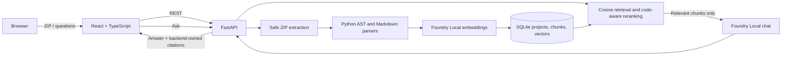

# RepoLens

RepoLens is a local-first RAG web application for exploring an uploaded Python codebase. It safely extracts a ZIP archive, indexes Python and Markdown on the same device, answers repository questions with local Foundry models, and links every grounded answer to inspectable source chunks.

## MVP status

Phase 6 is complete. The MVP includes the full ZIP upload → safe extraction → AST/Markdown chunking → local embeddings → SQLite → semantic retrieval → local chat → source viewer flow, plus a repeatable 20-question evaluation and real-repository stress tests.

<p align="center">
  
  &nbsp;&nbsp;
  
</p>

## Architecture



The FastAPI backend is the source of truth. The frontend never reads source files, builds citations, or calls models directly. Uploaded code is treated as untrusted data and is never imported or executed.

## What is included

- Safe ZIP validation with compressed/uncompressed size limits, file-count limits, Zip Slip protection, and symlink rejection
- Python AST chunks for modules, functions, classes, and methods; line-based fallback for syntax errors
- Markdown/MDX heading chunks with exact line ranges
- Secret-like, dependency, generated, binary, and oversized file exclusion
- Batched local embeddings and SQLite vector persistence
- Cosine retrieval with a configurable relevance threshold and code-location reranking
- Controlled `insufficient_context` responses that skip the chat model
- Grounded local chat with bounded follow-up context and backend-owned file, symbol, line-range, score, and snippet citations
- Responsive upload, project status, indexing, chat, source-card, and source-modal UI states
- Deterministic provider tests plus real Foundry Local evaluation

## Local setup

### Requirements

- Python 3.11 or newer
- Node.js 18 or newer
- Microsoft Foundry Local support on the machine; configured models are downloaded on first use if they are not cached. The default chat model is `qwen2.5-coder-1.5b` (about 1.8 GB).

### Backend

Run these commands from the repository root in PowerShell:

```powershell
python -m venv .venv
.\.venv\Scripts\Activate.ps1
python -m pip install --upgrade pip
pip install -r backend\requirements.txt
Copy-Item .env.example .env
python -m uvicorn app.main:app --app-dir backend --reload --host 127.0.0.1 --port 8000
```

Check `http://127.0.0.1:8000/api/health` after startup. The first indexing request or chat question can take longer while Foundry Local prepares or downloads the configured model.

### Frontend

Open a second PowerShell window:

```powershell
Set-Location frontend
Copy-Item .env.example .env
npm install
npm run dev -- --host 127.0.0.1 --port 5173
```

Open `http://127.0.0.1:5173`, upload a ZIP containing Python or Markdown files, wait for indexing, then ask a repository question and open one of its source cards.

## Verification

```powershell
Set-Location backend
..\.venv\Scripts\python.exe -m pytest -q -p no:cacheprovider

Set-Location ..\frontend
npm run build

Set-Location ..
.\.venv\Scripts\python.exe backend\scripts\run_evaluation.py
```

The recorded Phase 6 run indexed 46 supported files into 319 chunks. It achieved 100% retrieval hit rate (12/12), 100% citation hit rate (12/12), 100% unsupported-question handling (4/4), and 100% edge-case handling (4/4). Median retrieval time was 834 ms and median chat time was 14.02 seconds on the tested CPU Foundry provider. See [evaluation methodology and real-repository results](docs/evaluation.md) and the [raw result](evaluation/results/latest.json).

## Privacy and data

- Source archives, extracted files, SQLite records, embeddings, prompts, and inference remain on the local machine.
- No cloud LLM or hosted vector database is used. Initial model downloads may require internet access; cached models work offline afterward.
- Data is stored under `REPOLENS_DATA_DIR` (`./data` by default). The MVP has no delete button, so remove that local directory manually when its projects are no longer needed.
- RepoLens has no authentication. Bind it to localhost and do not expose the development server to an untrusted network.

## Known limitations

- Only `.py`, `.md`, and `.mdx` files are indexed. JavaScript, TypeScript, RST, notebooks, and other languages are skipped.
- Python is parsed statically. RepoLens does not resolve runtime dispatch, execute code, install dependencies, or build an import graph.
- Files larger than 512 KB are skipped by default; upload, uncompressed-size, and file-count limits are configurable.
- SQLite vectors are scanned in memory with NumPy. This is appropriate for small repositories, not large monorepos.
- CPU indexing can take several minutes even for a few hundred chunks. A tested 128-chunk embedding batch was unstable; the conservative default remains 32.
- Retrieval quality depends on the configured embedding model and thresholds. The default code-focused 1.5B chat model is more reliable than the earlier 0.5B default but can still phrase an answer poorly, so citations should be inspected.
- Re-indexing currently regenerates all chunks and embeddings; there is no content-hash cache or incremental update.
- There is no project deletion, authentication, multi-project search, background worker queue, or packaged desktop/Docker release.

## Roadmap

1. Additional language parsers and RST/notebook documentation support
2. Import/call graph signals and hybrid lexical-semantic retrieval
3. Content-hash caching and incremental indexing with real progress reporting
4. Project deletion, multi-project search, and storage management
5. Hardware-aware model selection, Docker packaging, and a desktop-friendly release

## More documentation

- [Evaluation and benchmark report](docs/evaluation.md)
- [Five-minute demo script](docs/demo.md)
- [Implementation context and roadmap baseline](docs/RepoLens_Copilot_Context.md)
