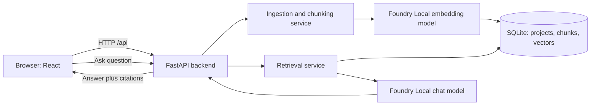

# RepoLens - Copilot Development Context

> Use this document as the implementation context for GitHub Copilot. Treat the decisions in this document as the baseline architecture unless a later instruction explicitly changes them.

## 1. Project Overview

### Product name

**RepoLens - Offline Codebase Onboarding Assistant**

### Problem statement

Developers joining an unfamiliar codebase spend significant time locating the correct files, services, functions, and documentation. Cloud-based AI code assistants can help, but sending a private codebase to an external service may be unacceptable. Small local language models also cannot independently inspect a user's filesystem unless an application supplies relevant context.

### Solution

RepoLens is a **local-first web application** that allows a user to upload a ZIP archive containing a software repository, indexes supported source and documentation files on the same device, and answers natural-language questions about that repository. Every answer must include verifiable source references: file path, symbol when available, line range, and an inspectable code snippet.

The core mechanism is Retrieval-Augmented Generation (RAG):

1. Extract code and documentation from an uploaded repository.
2. Split them into meaningful chunks, preferably by Python function, class, method, or Markdown heading.
3. Generate local embeddings for chunks with Microsoft Foundry Local.
4. Persist chunks, metadata, and vectors in SQLite.
5. Embed a user question and retrieve the most similar chunks.
6. Send only the retrieved chunks plus the question to a local Foundry Local chat model.
7. Return the answer together with citations generated from stored metadata.

### Target user

- A developer exploring an unfamiliar Python repository.
- A student learning a project architecture.
- A small team that wants a local/private codebase Q&A prototype.

### Core user journey

1. The user opens the local web application in a browser.
2. The user uploads a ZIP repository.
3. The backend validates and extracts the archive, scans supported files, generates chunks and embeddings, and stores the local index.
4. The UI shows indexing progress and summary statistics.
5. The user asks a question such as: `Where is user registration implemented?`
6. RepoLens answers using retrieved code only and shows clickable sources such as `src/services/user_service.py:18-64`.
7. The user can inspect each source snippet in the UI.

### MVP scope

- One uploaded project at a time, but keep the data model multi-project-ready.
- ZIP upload.
- Python (`.py`) and Markdown (`.md`, `.mdx`) support only.
- Python AST-based chunking and Markdown heading-based chunking.
- SQLite persistence.
- Local embeddings and local chat inference through Foundry Local.
- Semantic retrieval using cosine similarity over a small local corpus.
- React web UI, FastAPI REST API, source citations, and basic indexing status.
- Evaluation set containing answerable and intentionally unanswerable questions.

### Explicit non-goals for the MVP

- No cloud deployment, authentication, multi-user tenancy, billing, or GitHub OAuth.
- No automatic code modification or execution of uploaded code.
- No full agent that can execute terminal commands.
- No multi-language parser in the first version.
- No external vector database such as Pinecone, Weaviate, Chroma, or pgvector.
- No claim that answers are complete, correct, or a substitute for code review.

## 2. Tech Stack & Architecture

### Technology choices

| Layer | Choice | Rationale |
|---|---|---|
| Frontend | React + TypeScript + Vite + plain CSS/CSS modules | A portfolio-quality SPA with typed API calls and a clear component model. |
| Backend | Python 3.11+ + FastAPI + Uvicorn | Type-friendly REST API, easy integration with Python parsing and Foundry Local SDK. |
| Validation | Pydantic | Typed request/response contracts. |
| AI runtime | Microsoft Foundry Local SDK | Runs embedding and chat models on the local device. |
| Database | Python `sqlite3` | A serverless local database that matches the training project requirements. |
| Vector search | NumPy cosine similarity over vectors loaded from SQLite | Appropriate for a small repository corpus; avoids an unnecessary vector DB. |
| Code parser | Python standard library `ast` | Allows chunking by semantic Python boundaries and line numbers. |
| Archive handling | Python `zipfile` | Standard-library ZIP extraction with explicit security checks. |
| Tests | pytest + FastAPI TestClient | Unit tests, API tests, and retrieval evaluation. |
| Prototype UI (optional) | Streamlit | May be used only as a temporary API client before the React UI is complete. |

### Local-only architecture



All data, extracted archives, embeddings, SQLite records, and model inference remain on the local device. The initial download of models may require internet access; normal question answering should work offline once models are available locally.

### Backend responsibilities

The FastAPI backend is the source of truth. UI clients must not contain ingestion, embedding, retrieval, or database logic.

- Accept and validate ZIP uploads.
- Safely extract the archive into application-controlled storage.
- Exclude generated, binary, dependency, and secret-like files.
- Parse and chunk source documents.
- Create embeddings through an adapter around Foundry Local.
- Persist projects and chunks in SQLite.
- Retrieve relevant chunks for a question.
- Build a grounded prompt and call a local chat model.
- Return citations generated by backend metadata, not invented by the model.
- Provide deterministic error and status responses for the UI.

### Frontend responsibilities

- Upload a ZIP file.
- Display indexing state, errors, and project statistics.
- Offer a chat interface for a selected project.
- Render the answer separately from its source cards.
- Open a source viewer containing the exact indexed snippet and metadata.
- Never expose filesystem paths outside the uploaded project relative paths.

### Foundry Local integration

Hide SDK calls behind `EmbeddingProvider` and `ChatProvider` interfaces. This keeps the application testable and prevents model code from leaking into API handlers.

Configuration must come from environment variables or a typed settings module, never scattered literals:

```env
FOUNDRY_EMBEDDING_MODEL=qwen3-embedding-0.6b
FOUNDRY_CHAT_MODEL=qwen2.5-0.5b
REPOLENS_DATA_DIR=./data
REPOLENS_MAX_UPLOAD_MB=25
REPOLENS_TOP_K=4
REPOLENS_MIN_SIMILARITY=0.35
```

The default chat model should be small enough for development laptops. The model name must remain configurable because available models and hardware capacity vary. A stronger local model can be selected later without changing business logic.

### RAG behavior requirements

- Embed documents during indexing, not every time the user asks a question.
- Use the same embedding provider/model for document and query embeddings.
- For the MVP, load vectors for one selected project and rank them with cosine similarity.
- Retrieve `top_k` chunks, defaulting to 4.
- If no chunk meets `min_similarity`, return a controlled insufficient-context response; do not call the chat model.
- Prompt the chat model to answer only from the supplied context and to say that the repository does not contain enough information when appropriate.
- Citation objects must be generated by the backend from retrieved chunks. Do not depend on the model to format or invent citations.
- Preserve source order by retrieval score and return the score for debugging, not necessarily as a prominent end-user metric.

### Chunking rules

#### Python

Use `ast.parse` and line metadata.

- Create chunks for top-level `FunctionDef`, `AsyncFunctionDef`, and `ClassDef` nodes.
- For classes, create a small class-level chunk and separate chunks for methods. Each method chunk should include a short class header/context so a method name is not detached from its class.
- Store `symbol_name`, `symbol_type`, `start_line`, `end_line`, `language`, and `file_path` for every chunk.
- Keep module docstrings, imports, and meaningful top-level statements in a module-level chunk.
- For syntax errors, use a line-based fallback chunker and mark `parse_status="fallback"`.
- Avoid arbitrary character-only chunking for valid Python code.

#### Markdown

- Split by headings.
- Carry the heading hierarchy into the chunk metadata or content.
- Store the heading as `symbol_name` and line range where available.

### Files to include and exclude

Include only `.py`, `.md`, and `.mdx` in the MVP. Exclude directories and patterns such as:

```text
.git, .venv, venv, node_modules, __pycache__, dist, build,
.pytest_cache, coverage, .idea, .vscode, vendor
```

Do not index binaries, archives inside the archive, lockfiles, images, oversized files, `.env` files, private keys, or files containing likely secrets. Never execute any uploaded code.

### SQLite data model

Use schema migrations or a versioned `init_db()` function. Store embeddings as JSON text for simplicity and transparency in the MVP. A BLOB representation may be introduced only after the baseline works.

```sql
CREATE TABLE projects (
    id TEXT PRIMARY KEY,
    display_name TEXT NOT NULL,
    status TEXT NOT NULL,
    created_at TEXT NOT NULL,
    indexed_at TEXT,
    file_count INTEGER NOT NULL DEFAULT 0,
    chunk_count INTEGER NOT NULL DEFAULT 0,
    error_message TEXT
);

CREATE TABLE chunks (
    id TEXT PRIMARY KEY,
    project_id TEXT NOT NULL REFERENCES projects(id) ON DELETE CASCADE,
    file_path TEXT NOT NULL,
    language TEXT NOT NULL,
    symbol_name TEXT,
    symbol_type TEXT,
    start_line INTEGER NOT NULL,
    end_line INTEGER NOT NULL,
    parse_status TEXT NOT NULL,
    content TEXT NOT NULL,
    content_hash TEXT NOT NULL,
    embedding_json TEXT NOT NULL,
    created_at TEXT NOT NULL
);

CREATE INDEX idx_chunks_project_id ON chunks(project_id);
CREATE INDEX idx_chunks_project_file ON chunks(project_id, file_path);
```

### REST API contract

Prefix all endpoints with `/api`.

| Method | Path | Purpose |
|---|---|---|
| `GET` | `/api/health` | Service health and model availability summary. |
| `POST` | `/api/projects` | Upload and create a project from a ZIP archive. |
| `GET` | `/api/projects` | List local projects and indexing states. |
| `GET` | `/api/projects/{project_id}` | Return project metadata and statistics. |
| `POST` | `/api/projects/{project_id}/index` | Start/retry indexing; return `202 Accepted`. |
| `GET` | `/api/projects/{project_id}/status` | Poll indexing progress/status. |
| `POST` | `/api/projects/{project_id}/chat` | Ask a question about one indexed project. |
| `GET` | `/api/projects/{project_id}/chunks/{chunk_id}` | Read one source snippet/citation target. |
| `DELETE` | `/api/projects/{project_id}` | Optional later endpoint to remove a local project and its extracted files. |

Example chat request:

```json
{
  "question": "Where is user registration implemented?",
  "top_k": 4
}
```

Example chat response:

```json
{
  "answer": "User registration begins in `create_user`...",
  "answer_status": "grounded",
  "sources": [
    {
      "chunk_id": "...",
      "file_path": "src/services/user_service.py",
      "symbol_name": "create_user",
      "start_line": 18,
      "end_line": 64,
      "score": 0.82,
      "snippet": "def create_user(...): ..."
    }
  ]
}
```

Possible `answer_status` values: `grounded`, `insufficient_context`, `indexing_incomplete`, and `error`.

### Security and reliability constraints

- Reject archives above the configured maximum size.
- Protect against Zip Slip: resolve every extraction path and verify that it remains inside the intended project directory.
- Reject archive entries that are symlinks when the platform exposes that metadata.
- Generate server-side UUIDs; never trust a ZIP filename as a path.
- Store uploads under `data/uploads/<project_id>/`.
- Do not log complete source code or prompt context in production-style logs.
- Sanitize API errors: return useful messages without exposing server paths or stack traces.
- Use CORS only for the local React development origin, for example `http://localhost:5173`.
- Treat all uploaded repositories as untrusted input and never import, run, or install them.

### Testing and evaluation requirements

1. Unit-test Python AST chunking, Markdown chunking, exclusion rules, and safe ZIP extraction.
2. Unit-test cosine similarity and the minimum-similarity fallback.
3. API-test upload validation, project status, chat response shape, and source retrieval using mocked AI providers.
4. Maintain `evaluation/questions.json` with at least 20 questions:
   - 12 answerable questions with expected file paths or symbols.
   - 4 intentionally unanswerable questions.
   - 4 edge cases such as empty input, very broad input, or unsupported project state.
5. Measure retrieval success separately from language quality. A correct-looking answer without a relevant cited chunk is not a success.

## 3. Directory Structure

```text
repolens/
├── README.md
├── .gitignore
├── .env.example
├── docker-compose.yml                 # Optional, add only after MVP works
├── docs/
│   ├── architecture.md
│   ├── api-contract.md
│   └── evaluation.md
├── backend/
│   ├── pyproject.toml
│   ├── requirements.txt
│   ├── app/
│   │   ├── __init__.py
│   │   ├── main.py                    # FastAPI app and router registration
│   │   ├── core/
│   │   │   ├── config.py              # Typed settings from environment
│   │   │   ├── logging.py
│   │   │   └── errors.py
│   │   ├── api/
│   │   │   ├── router.py
│   │   │   ├── health.py
│   │   │   ├── projects.py
│   │   │   └── chat.py
│   │   ├── schemas/
│   │   │   ├── project.py             # Pydantic request/response models
│   │   │   ├── chat.py
│   │   │   └── source.py
│   │   ├── services/
│   │   │   ├── project_service.py
│   │   │   ├── ingestion_service.py
│   │   │   ├── indexing_service.py
│   │   │   ├── retrieval_service.py
│   │   │   ├── rag_service.py
│   │   │   └── archive_service.py
│   │   ├── parsers/
│   │   │   ├── base.py
│   │   │   ├── python_parser.py
│   │   │   └── markdown_parser.py
│   │   ├── providers/
│   │   │   ├── embeddings.py          # Provider interface + Foundry implementation
│   │   │   ├── chat.py                # Provider interface + Foundry implementation
│   │   │   └── foundry_local.py       # SDK lifecycle and model loading
│   │   ├── repositories/
│   │   │   ├── database.py
│   │   │   ├── project_repository.py
│   │   │   └── chunk_repository.py
│   │   └── prompts/
│   │       └── grounded_answer.txt
│   ├── tests/
│   │   ├── unit/
│   │   ├── integration/
│   │   ├── fixtures/
│   │   └── conftest.py
│   └── scripts/
│       └── run_evaluation.py
├── frontend/
│   ├── package.json
│   ├── vite.config.ts
│   └── src/
│       ├── main.tsx
│       ├── App.tsx
│       ├── api/
│       │   ├── client.ts
│       │   ├── projects.ts
│       │   └── chat.ts
│       ├── components/
│       │   ├── ProjectUploader.tsx
│       │   ├── ProjectList.tsx
│       │   ├── IndexingStatus.tsx
│       │   ├── ChatPanel.tsx
│       │   ├── SourceCard.tsx
│       │   └── SourceViewer.tsx
│       ├── pages/
│       │   ├── DashboardPage.tsx
│       │   └── ProjectPage.tsx
│       ├── types/
│       │   └── api.ts
│       └── styles/
│           └── app.css
├── evaluation/
│   ├── questions.json
│   └── reports/                        # Generated; gitignore large reports if needed
└── data/                               # Local runtime data; always gitignored
    ├── uploads/
    └── repolens.db
```

### Dependency boundaries

- API routers validate HTTP input and call services only. They must not contain RAG logic.
- Services orchestrate use cases but must not write raw SQL.
- Repositories own SQLite queries and persistence.
- Parsers turn files into typed chunk candidates; they do not call databases or models.
- Providers own Foundry Local SDK calls; tests replace them with deterministic fakes.
- React components call typed frontend API clients; they must not duplicate backend state rules.

## 4. Step-by-Step Implementation Plan

### Phase 0 - Scope and environment

**Goal:** Establish a reproducible local development environment and prevent scope drift.

Tasks:

1. Create a Git repository and the directory structure above.
2. Set up Python 3.11 virtual environment and FastAPI dependencies.
3. Create React + TypeScript + Vite frontend.
4. Install and verify Foundry Local with a minimal embedding and chat smoke test.
5. Add `.env.example`, `.gitignore`, linting/formatting decisions, and a short README.
6. Choose a small, license-compatible sample Python repository for demos (roughly 20-100 source files is sufficient).

Definition of done:

- Backend starts on `localhost:8000` and exposes `GET /api/health`.
- Frontend starts on `localhost:5173` and can call the health endpoint.
- A standalone Foundry Local smoke test can generate one embedding and one chat completion.

### Phase 1 - Backend skeleton and local project records

**Goal:** Make project creation visible end-to-end before adding AI.

Tasks:

1. Implement settings, error handling, database initialization, and `projects` table.
2. Implement `POST /api/projects` with ZIP validation but no indexing yet.
3. Implement `GET /api/projects`, `GET /api/projects/{id}`, and project status responses.
4. Add safe ZIP extraction with traversal protection and excluded-directory handling.
5. Add backend tests for invalid extensions, oversized uploads, invalid ZIPs, and Zip Slip attempts.
6. Build a minimal React upload form and project list.

Definition of done:

- A valid ZIP creates a project record and is extracted only inside `data/uploads/<project_id>/`.
- The dashboard lists the uploaded project and its status.
- Invalid archives fail safely with clear API messages.

### Phase 2 - Parsing, chunking, and SQLite index

**Goal:** Convert an uploaded repository into inspectable, source-addressable chunks.

Tasks:

1. Define a typed `ChunkCandidate` model.
2. Implement supported-file discovery and exclusion rules.
3. Implement Python AST chunking with function/class/method metadata.
4. Implement Markdown heading chunking.
5. Add the `chunks` table and repository functions.
6. Implement `POST /api/projects/{id}/index` initially without embeddings; store chunks with empty/test vectors only in a development branch or fixture path.
7. Implement `GET /api/projects/{id}/chunks/{chunk_id}` and a basic source viewer.
8. Write parser unit tests using representative fixtures, including malformed Python.

Definition of done:

- The system reports file and chunk counts.
- A source viewer can display a stored chunk with path, symbol, and exact line range.
- Python syntax failures do not crash indexing.

### Phase 3 - Local embeddings and retrieval

**Goal:** Build a deterministic, testable retrieval layer.

Tasks:

1. Implement `EmbeddingProvider` and `FoundryLocalEmbeddingProvider`.
2. Batch-generate embeddings during indexing and persist them in SQLite.
3. Implement query embedding, cosine similarity, ranking, `top_k`, and minimum similarity fallback.
4. Add `POST /api/projects/{id}/search` as a temporary debugging endpoint, or log retrieval results behind a development flag.
5. Update project status as `uploading`, `ready_to_index`, `indexing`, `indexed`, or `failed`.
6. Write tests with fake fixed embeddings to prove ranking behavior without downloading models.

Definition of done:

- A known question returns the expected function/file among the top retrieved chunks.
- An unrelated question triggers the insufficient-context behavior.
- Re-indexing does not create duplicate chunks for unchanged files.

### Phase 4 - Grounded local chat API

**Goal:** Turn retrieval into source-grounded answers.

Tasks:

1. Implement `ChatProvider` and `FoundryLocalChatProvider`.
2. Write a version-controlled grounded system prompt. The prompt must require use of supplied context only, concise answers, and an explicit insufficient-context response.
3. Implement `POST /api/projects/{id}/chat`.
4. Build answer citations in backend code from retrieved chunk metadata.
5. Return `answer_status` and structured source objects.
6. Ensure empty questions, unknown projects, and unindexed projects produce explicit error/status responses.

Definition of done:

- A chat response contains an answer and one or more real source objects for answerable questions.
- The model is not called when retrieval fails the relevance threshold.
- The returned citation points to a source viewer that displays the same chunk.

### Phase 5 - Prototype and production UI

**Goal:** Validate product flow quickly, then deliver a portfolio-quality React experience.

Tasks:

1. Optional: create a very small Streamlit client that calls the FastAPI API. Do not duplicate RAG logic in Streamlit.
2. Implement React dashboard, upload, project details, index status polling, chat, source cards, and source viewer.
3. Implement clear loading, empty, indexing, and error states.
4. Keep styling simple and readable. Prioritize evidence/source visibility over visual effects.
5. Configure local development CORS.

Definition of done:

- A user can upload, index, ask, and inspect sources entirely from the React UI.
- The backend remains usable without either UI for automated testing.
- The Streamlit prototype, if created, is optional and isolated from production source code.

### Phase 6 - Evaluation, documentation, and presentation

**Goal:** Demonstrate that RepoLens is an engineering project, not only a chat demo.

Tasks:

1. Create the 20-question evaluation set with expected source locations.
2. Run evaluation and record retrieval hit rate, unsupported-question handling, and median response time.
3. Add architecture diagram, setup instructions, limitations, data/privacy statement, and screenshots to README.
4. Prepare a 5-minute demo that includes:
   - Upload and indexing.
   - One answerable architecture question.
   - One function-location question.
   - One unanswerable question that safely returns insufficient context.
   - Inspection of a citation in the source viewer.
5. Add a short roadmap for post-MVP features: additional parsers, import graph, incremental indexing, multi-project search, Docker packaging.

Definition of done:

- Fresh setup instructions work on another machine.
- The demo succeeds without external cloud AI APIs.
- Evaluation results and known limitations are documented honestly.

## Copilot Coding Rules

- Prefer small, typed functions and explicit Pydantic schemas.
- Do not introduce cloud LLM APIs, hosted vector databases, authentication, Docker, or additional frameworks unless explicitly requested.
- Do not put business logic in FastAPI route handlers or React components.
- Do not execute uploaded code or trust archive paths.
- Do not fabricate citations. Citations come from retrieved chunk metadata only.
- Preserve source line numbers throughout ingestion, storage, retrieval, and UI rendering.
- Add tests before or alongside non-trivial parser, retrieval, or archive-security behavior.
- Keep the MVP focused on Python and Markdown; record broader-language support as a future feature rather than partially implementing it.
